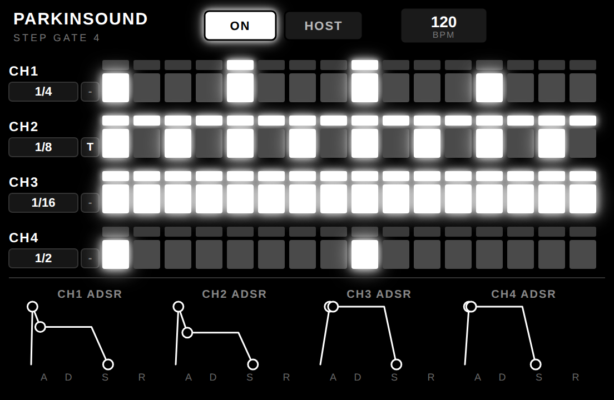

# Parkinsound Step Gate


A 16-step **rhythmic audio gate** sequencer with per-step On/Tie toggles and an
ADSR envelope, synced to the host transport or free-running. Divisions run
from 1/1 to 1/32, each with a straight, **dotted** (x1.5) or **triplet**
(x2/3) feel (`div_mod`).

The pattern can also follow the **host time signature** (`pattern_mode`):
in the *1 Bar* / *2 Bars* modes the effective pattern length is derived
from the meter (12 sixteenths in 3/4 or 6/8, 14 eighths in 7/4, capped at
16) and step 1 is pinned to the bar start. The meter comes from the host
(`time:beatsPerBar` / `time:beatUnit` in LV2, the DAW time signature in
VST3/AU) or from the manual `meter_num` / `meter_denom` ports (also the
Free Run fallback). The `active_steps` output reports the effective
length, and the UIs grey out the unused steps. Hosts that count in a
non-quarter beat unit (e.g. 6/8) are now normalised correctly.

- **LV2** — Linux desktop, MOD Audio, Raspberry Pi...
- **VST3 / AU / Standalone** — macOS (universal) and Windows, via JUCE

This repository ships two plug-ins:

- **parkinsound-stepgate.lv2** — the original single (stereo) step gate.
- **parkinsound-stepgate4.lv2** — a 4-channel, sample-locked variant.

---

## Step Gate 4 (4 channels)



Step Gate 4 folds **four gate voices into a single plug-in**. All four channels
are processed in the same `run()` call and advanced from one shared *master
beat*, so they trigger simultaneously and stay phase-locked forever — ideal for
tight polyrhythms (see the `Polyrhythm` factory preset).

- **4 mono in / 4 mono out** (`in_1..in_4`, `out_1..out_4`).
- **Shared**: Sync Source (Host Sync / Free Run), Tempo, global Enabled
  (soft bypass), Pattern Length (16 Steps / 1 Bar / 2 Bars) and the
  meter source / manual meter.
- **Per channel**: Division and its straight/dotted/triplet feel
  (`chN_div_mod`), the 16 On/Tie step toggles, the ADSR envelope, and
  the `chN_active_steps` output (effective pattern length).

---

## Build LV2 (Linux desktop)

Requires `pkg-config` and the LV2 headers (`lv2-dev`).

```sh
make -j4               # builds both bundles
sudo make install-all  # installs both to /usr/lib/lv2
```

Useful targets: `make stepgate`, `make stepgate4`, `make install`
(installs only the single-channel bundle).

---

## Build for MOD with mod-plugin-builder

With a [mod-plugin-builder](https://github.com/mod-audio/mod-plugin-builder)
environment in place, copy the contents of
`plugins/package/parkinsound-stepgate` (and/or `parkinsound-stepgate4`) into
`mod-plugin-builder/plugins/package/`, then:

```sh
# From the mod-plugin-builder root
./build <platform> parkinsound-stepgate
./build <platform> parkinsound-stepgate4
```

---

## Build VST3 / AU / Standalone (macOS and Windows)

JUCE project in `juce/`. JUCE is downloaded automatically (FetchContent).

```sh
cmake -B juce/build -S juce -DCMAKE_BUILD_TYPE=Release
cmake --build juce/build --config Release --parallel
```

The binaries land in `juce/build/ParkinsoundStepGate_artefacts/Release/`
(`AU/`, `VST3/`, `Standalone/`).

Pass `-DLOCAL_JUCE_DIR=/path/to/JUCE` to build from an offline checkout. On
macOS the build is universal (arm64 + x86_64). GitHub Actions
(`.github/workflows/build.yml`) produces macOS-universal and Windows artefacts.
See `docs/lv2-to-multiplatform.md` for the porting playbook.

---

## Tests

```sh
gcc -O2 -Wall -o test/divcheck test/divcheck.c -ldl -lm && ./test/divcheck
gcc -O2 -Wall -o test/sync4    test/sync4.c    -ldl -lm && ./test/sync4
gcc -O2 -Wall -o test/barcheck test/barcheck.c -ldl -lm && ./test/barcheck
```

`test/sync4` verifies the 4-channel sample-accurate sync: identical channels
produce bit-identical output, and a slower channel's step boundaries land on
the exact same samples as a faster channel's (including straight vs triplet,
which re-lock 3:2). `test/barcheck` simulates hosts in 3/4, 6/8, 5/4 and 7/4
(continuous and mod-host-style quantised transports, plus a mid-run meter
change) and checks the bar-aligned pattern modes.

---

## License

GPL-3.0-or-later.
